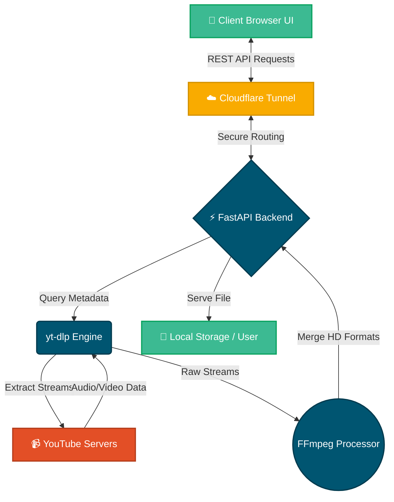

<div align="center">


<br><br>

[](https://fastapi.tiangolo.com/)
[](https://www.python.org/)
[](https://nodejs.org/)
[]()
[]()
[]()
[]()
[](https://opensource.org/licenses/MIT)

<br><br>

<a href="https://colab.research.google.com/github/RashidKhanApDev/YoutubeDownloader/blob/main/YoutubeDownloader.ipynb" target="_blank">
  
</a>

<br><br>

> *Say goodbye to intrusive ads and slow downloads. Experience the premium way to fetch your favorite YouTube content locally or on the cloud.*

</div>

---

## 📑 Table of Contents
1. [🌟 Overview & Description](#-overview--description)
2. [✨ Premium Features](#-premium-features)
3. [🏗️ Architecture & Flow](#️-architecture--flow)
4. [🛠️ Tech Stack Showcase](#️-tech-stack-showcase)
5. [📂 Project Structure](#-project-structure)
6. [📥 Installation & Setup](#-installation--setup)
7. [🇮🇳 ചെറുവിവരണം (Malayalam)](#-ചെറുവിവരണം-malayalam-summary)

---

## 🌟 Overview & Description

Welcome to the **Ultimate YouTube Downloader**! This modern, responsive web application is built on top of the lightning-fast **FastAPI** framework and powered by the robust `yt-dlp` library. 

Whether you are looking to save a quick audio track for your playlist or download a stunning cinematic video in pristine **4K or 8K resolution**, this tool has you covered. Designed with a gorgeou[...]

---

## ✨ Premium Features

| 🎥 Extreme High-Resolution | 🎵 Audio-Only Extraction | ⚡ Dynamic Resolution |
| :---: | :---: | :---: |
| Seamlessly download videos in 1080p, 1440p (2K), 2160p (4K), and up to 8K. | Extract crystal-clear MP3/M4A audio effortlessly with a single click. | Automatically detects and lists all available[...]

| 🎨 Modern Aesthetic | 🚀 Fast & Lightweight | ☁️ Cloud Ready |
| :---: | :---: | :---: |
| Beautiful, responsive, and intuitive Glassmorphism interface. | Powered by FastAPI for asynchronous, non-blocking execution. | One-click deployment to Google Colab via Cloudflare Tunnels. |

---

## 🏗️ Architecture & Flow

Our system architecture is designed for speed, reliability, and security. Below is the visual representation of how data flows through our ecosystem:



---

## 📂 Project Structure

A clean, organized, and scalable directory layout ensures maximum developer productivity:

```bash
📦 YoutubeDownloader
 ┣ 📂 templates/           # Frontend UI Assets
 ┃ ┗ 📜 index.html         # Premium Glassmorphism View
 ┣ 📂 downloads/           # Secure Output Directory
 ┣ 📜 main.py              # Application Core (FastAPI)
 ┣ 📜 run_server.py        # Cross-platform Process Manager
 ┣ 📜 create_colab.py      # Cloud Generation Engine
 ┣ 📜 YoutubeDownloader.ipynb # Auto-generated Notebook
 ┣ 📜 requirements.txt     # Dependency Definitions
 ┣ 📜 run.bat              # Windows Automation Script
 ┣ 📜 run.sh               # Linux Automation Script
 ┗ 📜 README.md            # Project Documentation
```

---

## 🛠️ Tech Stack Showcase

We utilized multiple industry-standard languages and frameworks to deliver this premium experience.

### ⚙️ JSON (Configuration)
```json
{
  "app_name": "YoutubeDownloader",
  "version": "3.5.0",
  "author": "Rashid Khan",
  "license": "MIT"
}
```

### 🐍 Python (Backend API)
```python
from fastapi import FastAPI
import yt_dlp

app = FastAPI(title="YouTube Downloader API")

@app.get("/api/info")
async def get_video_info(url: str):
    # Asynchronously fetch video metadata
    pass
```

### 🟨 JavaScript (Frontend Logic)
```javascript
async function fetchDownloadUrl(videoId) {
    const response = await fetch(`/api/download?id=${videoId}`);
    const data = await response.json();
    return data.download_url;
}
```

### 🟧 HTML (Structure)
```html
<div class="glass-container">
    <h1>YouTube Downloader</h1>
    <input type="text" placeholder="Paste YouTube Link Here...">
    <button class="btn-primary">Fetch Video</button>
</div>
```

### 🟦 CSS (Glassmorphism Styling)
```css
.glass-container {
    background: rgba(255, 255, 255, 0.1);
    backdrop-filter: blur(10px);
    border: 1px solid rgba(255, 255, 255, 0.2);
    border-radius: 20px;
    box-shadow: 0 8px 32px 0 rgba(31, 38, 135, 0.37);
}
```

### 🟦 TypeScript (Next-Gen UI Typing)
```typescript
interface VideoDetails {
    id: string;
    title: string;
    resolutions: Array<string>;
    duration: number;
}
```

### 🐹 Go (High-Speed Microservice Concept)
```go
package main
import "fmt"

{